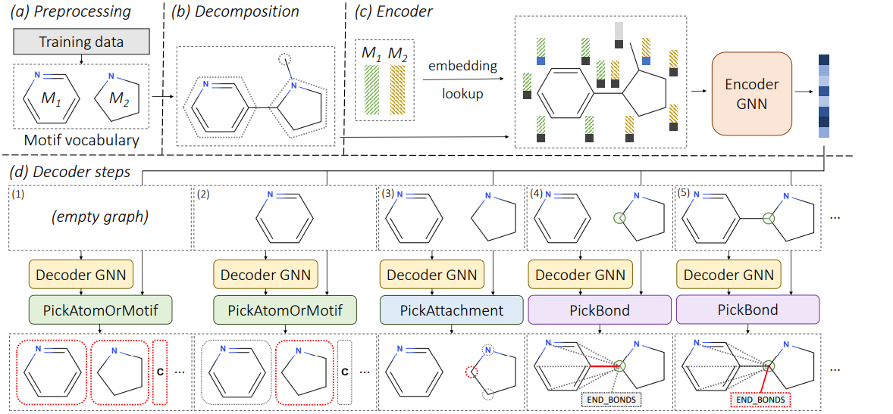

```{r setup, include=FALSE}
knitr::opts_chunk$set(echo = TRUE)
```

## Overview of the Approach 


```{r approch,out.width = "100%",echo = FALSE,fig.align='center',fig.cap="Overwiew of the methdology."}

```

## Discussion

Existed methodologies are limited with scaffold and, this study is proven to overcome the limitations of scaffold predictions which requires a known existed scaffold.

## References