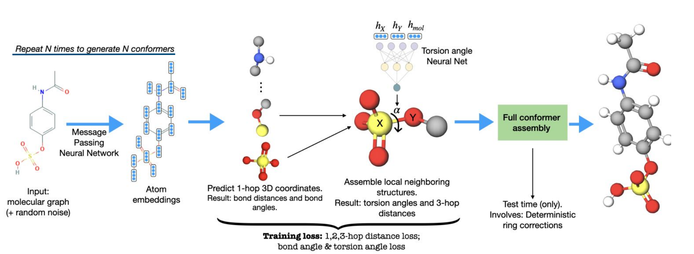

```{r setup, include=FALSE}
knitr::opts_chunk$set(echo = TRUE)
```

## Overview of the Approach 

Recent breakthroughs in deep learning allow us to predict protein 3-Dimensional structure from the protein linear sequence using specifically designed tools, such as *AlphaFold2* with great accuracy. However, the prediction of 3-D molecule structures with great accuracy remains still as an open problem. 

Existing techniques for determining molecular conformations are expensive therefore, predictive models have been developed over the past decade. These approaches, typically divided into two categories: stochastic models, which rely on random fluctuations, and systematic models, which are based on rules. Stochastic methods are traditionally based on molecular dynamics (MD) or Markov chain Monte Carlo (MCMC) techniques, possibly combined with genetic algorithms. They allow extensive exploration of the energy landscape and accurately sample equilibrium structures, but they are extremely slow for large molecules. For a single drug-like molecule, they may require several CPU minutes. 

```{r OLC,out.width = "100%",echo = FALSE,fig.align='center',fig.cap="Overwiew of GEOMOL methdology."}

```

The approaches to resolving protein folding challenges are not transferable to general molecular data, because molecules may contains cycles, different bonds that may yield higly branched graph structures which is hard to deal with existed machine learning frameworks. Therefore, a need for an approach to generate distributions of low-energy molecular 3D conformers remained. *GEOMOL* is an end-to-end, non-autoregressive and SE(3)-invariant machine learning approach that is specifically designed to generate distributions of low-energy molecular three dimensional conformers. @Ganea2021 Below, the overall framework of *GEOMOL* is summarized:

 *Step 1:* Each molecular graph in addittion to random noise inputted to message passing neural network. Message passing framework of *GEOMOL* computes molecular embedding (ie. atom embedding of an input molecule).
 
*Step 2:*  *GEOMOL* predicts the 3-dimensional position of of all its 1-hop neighbouring nodes for each atom in a permutation equivariant way to obtain bond distances and bond angles.

*Step 3:* Local neighbouring structures are assembled using a neural network that obtains torsional angle.

*Step 4 (Test Step): * Forming full conformer assembly with ring corrections.


## Discussion

 *GEOMOL* tries to answer this question: "Can we design fast ML generative models of high quality, representative, diverse, and generalizable low-energy 3D conformational ensembles from molecular graphs?" as stated by the authors. The model is trainable end-to-end, non-autoregressive, and does not require distance geometry techniques to work correctly. The model outputs a minimal set of geometric quantities. Therefore, we can fully reconstruct the 3D conformation of the molecule by using the correct angles and distances. By design, the model adapts to the shapes of the molecules in a SE(3)-invariant way. In this context, *GEOMOL* successfully able to predict tetrahedral chiral centers, bond distances, bond angles and torsion angles and, all 3D coordinates of atoms from the molecular graph. The desired inductive bias has either been completely or partially captured in the past utilizing multi-step distance geometry approaches. *GEOMOL* generally outperforms its competitors such as *OMEGA* @Hawkins2010 which is a commercially available systematic knowledge-based conformer generator, in terms of accuracy and, running time when they are trained using the same datasets.
 

 The fundamental components of molecular geometry, such as torsion angles and local 3D structures, are explicitly represented in this model (bond distances and angles adjacent to each atom). These are combined with the input molecular network to compute the k-hop distance during training and the entire deterministic conformation assembly during testing. Despite this improvement, *GEOMOL* is not able to capture long-range interactions. For example, the prediction of macrocycle structures has been difficult because of errors accumulated from the way *GEOMOL* constructs conformers. This type of error accumulation can sometimes lead to imperfect structures, as the ring smoothing algorithm breaks down for large cycles. Furthermore, it is qualitatively observed that large rings with very sparse examples in the training dataset may yield to poor predictions in test set. In such cases, using additional training set may help with the predictions however, this may increase computational expenses of training.
 
The most common error introduced by *GEOMOL* is when there are clashes in the structure of the molecules. The reason for this, GEOMOL struggles to consider the location of atoms that are far away from the graph connectivity, which might result in overlapped atoms in the final prediction because global conformer information during twist predictions is only given through graph network representations. The *GEOMOL* method is limited to 3 hops, so nodes with distances less than 3 hops cannot be distinguished by the MPNN used in *GEOMOL* step 1. Recently, the motif prediction framework for graph neural networks has been offered by @Besta2021. The *GEOMOL* framework can be improved using the correlation information of the links to resolve the issue. If a graph representation of a molecule contains nodes above a threshold that has been set, it can be parsed into sub-graphs based on the correlation information of the links. Then, nodes can be updated using a message passing framework. Then based on the initial correlation information between the links, the links with closest yet, not appeared in sub-graphs together may be assembled back together. In other words, can we divide macromolecules into smaller sub-molecules to overcome to limitations of hops? After the message passing step, the disrupted local neighbour structures can be recovered. 


## References

