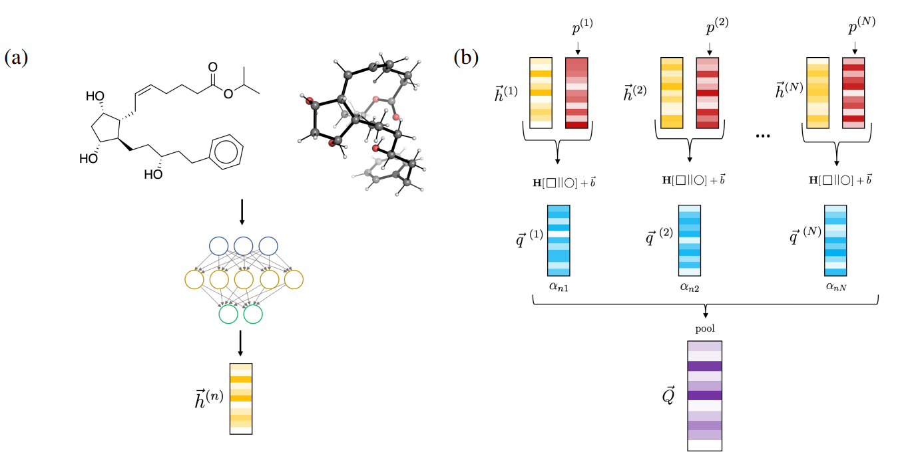

```{r setup, include=FALSE}
knitr::opts_chunk$set(echo = TRUE)
```

## Overview of the Approach 

A potential in silico regularly utilized in the drug development process is virtual screening. Scientists can use the in silico approches to find potential candidates for experimental investigation. Thus, the cost and time required to bring a novel drug to market can be decreased by automatically identifying promising new drug candidates. In the human body, molecules often adopt a particular three-dimensional configuration referred to as conformation. These molecules are not static. In other words, these molecules are able to rotate or spin since they are not in rigid form. This paper claims that a molecular ensemble is definable by compiling all the permitted conformational mobility. This suggestion is significantly important because it enables us to examine a more accurate model of the molecule in its environment. 


Current approaches are used to establish three-dimensional conformations of molecules, separated into two categories: physics-based simulations and, data-driven supervised models. As physics-based simulations, computational docking and molecular simulation are constrained by scoring functions and force fields, whereas the performance of the machine learning methods' depends on the availability of data. 

 QSAR or classical QSAR (quantitative structure-activity relationship) is a commonly used traditional methodology to predict molecular properties. The generation of features by traditional QSAR approaches is based on physical constraints. One such hypothesis is that the interactions between ligands and receptors impact binding affinity and specificity. For instance, the well-known *CoMFA* approach aligns molecules in a 3D grid, calculates the steric and electrostatic fields at various locations surrounding the molecules, aggregates these values into features, and then uses partial least-squares to link the features with biological activity. @Cramer1988 In addition to these, the *GRID* approach takes hydrogen bonding and hydrophobic interactions into consideration. @Goodford1985 These are the commonly used 3-D QSAR methodologies. There are additional 4D QSAR techniques that utilize various molecular conformations.
 

In addition to QSAR, deep learning is one of the broad approaches used in computational drug discovery. Due to rapid advances in representation learning, such as graph convolutional neural networks, deep learning has been gaining attention over the years. In theory, supervised learning, more specifically neural networks are able to learn any function and, can bring a significant upgrade over physics-based techniques in terms of speed and performance. For instance, neural networks can learn how to map molecules based on their physical properties. Similar to QSAR methodology, deep learning approaches forecast molecular properties by applying a readout function to a molecule's characteristics. However, there are still limitations present in the existed methodologies. For instance, except for *CoMFA* approach, existing methodologies assume that the conformation with the lowest energy is the bioactive conformation and, they require choosing a molecular configuration for each species. In this context, message-passing neural networks gained additional popularity as they get their features directly from the molecules in the training set. 

"Can three dimensional information from numerous conformers enhance molecular properties that predicted by deep learning methods?" is the main research question that this work seeks to answer. Multiple deep learning models have been trained to address this question by incorporating multiple conformer inputs and conformer attention to key architectures such as *ChemProp* and *Schnet*. @Axelrod2020

```{r approch,out.width = "100%",echo = FALSE,fig.align='center',fig.cap="Overwiew of the methdology."}

```

The proposed model follows the framework as:

1. A neural network creates a molecular fingerprint by combining the 3D structure of the nth conformer with its graph information. Each fingerprint is associated with a corresponding weight that estimates the statistical probability of that fingerprint conformer. To create a final fingerprint, the new fingerprints are combined using an attention mechanism.

2.  Attention compares the importance of one set of features with another set of features by combining the learned vector with two feature vectors, either letting the attention mechanism learn the importance of one conformer's features in relation to another or, using linear attention, to learn the overall importance of a conformer.

3. Interatomic distances are computed by the average of the distances across all conformers in this model, where messages are sent across a single effective conformer. When compared to employing several conformers, the advantage of this model is that it reduces the computational cost.

4. Then the mean and SD of conformer WHIM vectors are used for training. Then, the weighted average (WHIM) of each conformer for each species using RDKit is computed. Afterwards,  the mean and standard deviation are computed using the statistical weights of the conformers. Thus, each of the WHIM features was scaled to have zero mean and variance. 

As a result, the study concatenates WHIM characteristics with those produced via message-passing, the conformers are formed in a vacuum rather than being sampled from ligand-receptor MD.

## Discussion

The results indicates that in general, 3D models are more expensive than 2D models and, the attention-based 4D models are computationally most intensive models. Single conformer model predictions are typically less expensive than models that use conformer-based constructions. And, in this case, using conformer models will not bring any advantages.

Adding 3D information can improve prediction accuracy when the correct model is used.

The CND model is more effective than traditional baselines in predicting outcomes. There is some debate over whether 3D models improve performance or degrade it, but in general, most 3D models aren't actually that beneficial. Some can even have a negative impact on performance.The computational cost of training a single conformer model is usually a better use of resources than training multiple models. However, transfer learning can sometimes improve accuracy slightly, but the effect is usually small and not present in most models. 

The conformers that are selected to form hits are more similar to one another than the conformers that are not selected.


## References